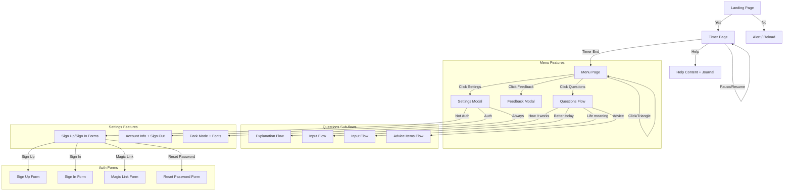

# Better Life - Application Blueprint v2

This document serves as a comprehensive reference for the application's structure, defining pages, their elements, features, and the flow between them. **Version 2** includes all existing features in the current codebase.

## Navigation Flow

## Page Definitions

### 1. Landing Page
**ID:** `#landing-page`  
**Purpose:** Initial user engagement.  
**Elements:**
*   `h1`: "Do you want to make your life better?"
*   `#btn-yes` (Button): Transitions to **Timer Page**.
*   `#btn-no` (Button): Changes page content to "Ok." and reloads on click.
*   `.center-content` (Div): Container for centered content.

**Transitions:**
*   Clicking **Yes** -> Navigate to **Timer Page**.
*   Clicking **No** -> Display "Ok." and make page clickable to reload.

---

### 2. Timer Page
**ID:** `#timer-page`  
**Purpose:** The core focus session with timer and journaling capabilities.  
**Elements:**

#### Timer Display Elements
*   `#timer-intro` (Div): Initial timer view with instruction.
    *   `#timer-instruction` (h2): "Spend [timer] minutes making your life better."
    *   `#timer-display` (Span): Shows MM:SS format (e.g., "10:00").
    *   `#timer-controls` (Div): Container for start button.
        *   `#btn-start-timer` (Button): "Start timer" - Initiates timer countdown.

#### Circular Timer (Hidden Initially)
*   `#circle-timer` (Div): Circular progress timer (shown after start).
    *   `.circle-wrapper` (Div): Container for SVG circle.
    *   `.progress-ring` (SVG): Visual progress indicator.
        *   `.progress-ring-bg` (Circle): Background circle.
        *   `.progress-ring-circle` (Circle): Progress circle (updates during countdown).
    *   `#circle-time` (Div): Text display of remaining time (MM:SS).

#### Help & Journal Elements
*   `#btn-help-icon` (Button): Help icon button (fixed position, bottom-right, "?").
    *   Toggles visibility of `#help-content`.
    *   After 3 seconds of showing help, reveals `#journal-tab`.
*   `#help-content` (Div): Help text content (hidden by default).
    *   Text: "You are the expert on how to make your life better."
    *   Text: "If you aren't sure where to start, writing about it goes a long way."
*   `#journal-tab` (Div): Journal entry area (hidden by default, auto-reveals 3s after help).
    *   `#journal-entry` (Textarea): Text input for journaling during timer.
        *   Placeholder: "Write here..."

**Timer Behavior:**
*   **Start**: Clicking `#btn-start-timer`:
    *   Fades out `#timer-intro`.
    *   Fades in `#circle-timer`.
    *   Begins countdown from current timer duration.
*   **Pause/Resume**: Clicking on `#circle-timer` (circle wrapper):
    *   Pauses if running, resumes if paused.
    *   Updates button text accordingly.
*   **Progress Ring**: Visual indicator updates every second showing remaining time.
*   **Completion**: When timer reaches 00:00:
    *   Automatically transitions to **Menu Page**.
    *   Updates streak (increments timer duration by 10 minutes if new day).
    *   Saves session data (if authenticated, syncs to Supabase).

**State Management:**
*   Timer duration starts at 10 minutes (600 seconds) by default.
*   Duration increases by 10 minutes each day a session is completed.
*   Current timer value persists in state and updates progress ring.

---

### 3. Menu Page
**ID:** `#menu-page`  
**Purpose:** Post-session summary, navigation hub, and interactive experience.  
**Elements:**

#### Menu Content
*   `#menu-content` (Div): Main menu container.
    *   `.menu-title` (h1): "Good job, come back again tomorrow."
    *   `.floating-buttons` (Div): Container for draggable menu buttons.
        *   `#btn-questions` (Button, `.float-btn .float-1`): Opens **Questions Flow**.
        *   `#btn-feedback` (Button, `.float-btn .float-3`): Opens **Feedback Modal**.
        *   `#btn-settings` (Button, `.float-btn .float-4`): Opens **Settings Modal**.
    *   `#menu-triangle` (Div, `.menu-triangle`): Interactive triangle element.
        *   Hidden initially, fades in after title fade-out.
        *   Rotates toward mouse cursor on menu page.
        *   Moves toward click position (80% of distance).
        *   Points toward current mouse/cursor position.

#### Questions Flow (`#questions-flow`)
**Hidden by default, shown when Questions button clicked.**

*   `.question-item` (Div): Individual question elements.
    *   `#q-how-it-works` (`.q1`): "How does this work?"
    *   `#q-better-today` (`.q2`): "How did you make your life better today?"
    *   `#q-better-life-meaning` (`.q3`): "What does a better life mean to you?"
    *   `#q-advice` (`.q4`): "Looking for advice?"

**Sub-flows triggered by clicking questions:**

##### How It Works Flow (`#how-it-works-flow`)
*   `.explain-item` (Div): Explanation lines (fade in sequentially).
    *   `.e1`: "Every day that you complete a focus session on Better Life, the timer will increase by 10 minutes."
    *   `.e2`: "If you miss a day, the number will drop by 10 minutes. The minimum is 10 minutes."
    *   `.e3`: "How high can you get the number?"

##### Better Today Flow (`#better-today-flow`)
*   `#better-today-input` (Input, `.borderless-input`): Text input field.
    *   Placeholder: "Write here..."
    *   Auto-saves on blur or Enter key.
    *   Saves to Supabase (if authenticated) and localStorage.

##### Better Life Meaning Flow (`#better-life-meaning-flow`)
*   `#better-life-meaning-input` (Input, `.borderless-input`): Text input field.
    *   Placeholder: "Write here..."
    *   Auto-saves on blur or Enter key.
    *   Saves to Supabase (if authenticated) and localStorage.

##### Advice Flow (`#advice-flow`)
*   `.advice-item` (Div): Advice suggestions (fade in sequentially).
    *   "Active not Passive"
    *   "Journal"
    *   "Exercise"
    *   "Meditation"
    *   "Planning"
    *   "Writing"
    *   "Drawing"
    *   "Music"

**Menu Interactions:**
*   **Floating Buttons**: Draggable buttons that can be repositioned.
    *   Initial positions:
        *   Questions: Top center (15% from top).
        *   Settings: Bottom left (70% from top).
        *   Feedback: Bottom right (70% from top).
    *   Buttons are bounded within viewport.
    *   Drag state prevents click events from firing.
*   **Triangle Interaction**:
    *   Rotates smoothly toward mouse cursor position.
    *   Moves toward click position (80% of distance to click).
    *   Does not interact when hovering over buttons or other interactive elements.
    *   Animation uses CSS transforms for smooth rotation.

**Transitions:**
*   Clicking menu buttons triggers fade-out of menu content.
*   Questions flow fades in with sequential question animations (800ms delay between each).
*   Sub-flows animate questions sliding to top, then showing input/explanation.
*   Clicking background of flows resets to menu view.

---

## Modals

### Modal System
**Shared Elements:**
*   `#modal-overlay` (Div): Background overlay for all modals (hidden by default).
*   `#modal-content` (Div): Container for modal content.
*   `#close-modal` (Span): Close button (×) - closes active modal.
*   `#modal-body` (Div): Dynamic content area for modal content.

### Feedback Modal
**Trigger:** `#btn-feedback` button on Menu Page.

**Content:**
*   `h2`: "Feedback"
*   `#feedback-message` (Textarea, `.feedback-textarea`): User feedback input.
    *   Placeholder: "Your feedback..."
*   `#btn-submit-feedback` (Button): Submit button.
*   `#feedback-status` (Div, `.auth-message`): Status message (success/error).

**Behavior:**
*   Modal opens with fade-in animations (staggered delays).
*   Submit sends feedback to Supabase (if authenticated).
*   Success message shown, modal auto-closes after 2 seconds.
*   Close button hidden (modal closes via auto-close or submission).

### Settings Modal
**Trigger:** `#btn-settings` button on Menu Page.

**Content Structure:**

#### For Anonymous Users (Not Authenticated)

**Account Section:**
*   `h3`: "Account"
*   `p` (`.auth-info`): "Sign up to sync your progress across devices"
*   `.auth-button-group`: Container for auth action buttons.
    *   `#auth-show-signup` (Button): Opens Sign Up form.
    *   `#auth-show-signin` (Button): Opens Sign In form.

**Auth Forms Container** (`#auth-forms`):
Hidden initially, shown when Sign Up or Sign In clicked.

*   **Sign Up Form** (`#signup-form`):
    *   `h3`: "Create Account"
    *   `#signup-email` (Input): Email input.
    *   `#signup-password` (Input): Password input (min 6 characters).
    *   `#signup-submit` (Button): Create Account button.
    *   `#signup-to-signin` (Link): "Already have an account? Sign in"
    *   `#auth-message` (Div): Status messages.
*   **Sign In Form** (`#signin-form`):
    *   `h3`: "Sign In"
    *   `#signin-email` (Input): Email input.
    *   `#signin-password` (Input): Password input.
    *   `#signin-submit` (Button): Sign In button.
    *   Links:
        *   `#show-magic-link`: "Send me a magic link instead"
        *   `#show-reset-password`: "Forgot password?"
        *   `#signin-to-signup`: "Don't have an account? Sign up"
    *   `#auth-message` (Div): Status messages.
*   **Magic Link Form** (`#magic-link-form`):
    *   `h3`: "Magic Link"
    *   `p`: "We'll send you a link to sign in without a password"
    *   `#magic-email` (Input): Email input.
    *   `#magic-submit` (Button): Send Magic Link button.
    *   `#magic-to-signin` (Link): "Back to sign in"
    *   `#auth-message` (Div): Status messages.
*   **Password Reset Form** (`#reset-password-form`):
    *   `h3`: "Reset Password"
    *   `p`: "We'll send you a link to reset your password"
    *   `#reset-email` (Input): Email input.
    *   `#reset-submit` (Button): Send Reset Link button.
    *   `#reset-to-signin` (Link): "Back to sign in"
    *   `#auth-message` (Div): Status messages.

#### For Authenticated Users

**Account Section:**
*   `h3`: "Account"
*   `.account-card`: Container for account info.
    *   `.account-info`: Account details.
        *   `.account-email`: User's email address.
        *   `.account-meta`: "Current timer: [X] minutes"
    *   `#auth-signout` (Button): Sign Out button.

#### Appearance Settings (All Users)

**Dark Mode Toggle:**
*   `h3`: "Appearance"
*   `.dark-mode-toggle`: Toggle switch container.
    *   `label`: Toggle label.
        *   `span`: "Dark Mode"
        *   `#dark-mode-switch` (Checkbox): Toggle input.
        *   `.toggle-slider`: Visual slider element.

**Font Selector:**
*   `.font-selector`: Font selection container.
    *   `label`: "Font"
    *   `#font-select` (Select): Font dropdown.
        *   **Available Fonts:**
            1. Helvetica Neue
            2. Inter
            3. Roboto
            4. Open Sans
            5. Lato
            6. Montserrat
            7. Playfair Display
            8. Merriweather
            9. Source Sans Pro
            10. Raleway
    *   Font preview in dropdown (each option styled with its font).

**Timer Section:**
*   `h3`: "Timer"
*   `p`: "Customize Journal, Timer Style (Coming soon)"

**Behavior:**
*   Settings modal content adapts based on authentication state.
*   Auth forms fade in/out when switching between forms.
*   Dark mode toggle persists to localStorage and state.
*   Font selection persists to localStorage and applies immediately.
*   Sign out reloads page to reset state.
*   Close button hidden (modal closes via close button or sign out).

---

## Debug Controls

**Location:** Always visible (development/testing tool).

**Elements:**
*   `#debug-controls` (Div): Container for debug buttons.
    *   `#btn-debug` (Button): "DEBUG"
        *   Subtracts minutes from timer (based on `#debug-minutes` value).
        *   If timer reaches 0, automatically completes session and shows menu.
    *   `#btn-debug-menu` (Button): "MENU"
        *   Immediately navigates to Menu Page (bypasses timer).
    *   `#debug-minutes` (Input): Number input for minutes to subtract.
        *   Default value: 1
        *   Minimum: 1

**Purpose:** Development tool for testing timer completion and menu navigation without waiting for full timer countdown.

---

## Data State & Persistence

### LocalStorage Keys
*   `bl_timerDuration`: Current timer length (seconds, default: 600).
*   `bl_lastDate`: Date string of the last completed session.
*   `bl_history`: Array of saved question entries.
*   `bl_darkMode`: Dark mode preference (boolean).
*   `bl_fontFamily`: Selected font family value.

### Application State (app-state.js)
**Managed State:**
*   `timerDuration`: Timer duration in seconds (persists to localStorage).
*   `currentTimer`: Current timer value during countdown (not persisted).
*   `lastSessionDate`: Last session completion date (persists to localStorage).
*   `isTimerRunning`: Timer running state (not persisted).
*   `darkMode`: Dark mode preference (persists to localStorage).
*   `fontFamily`: Font family preference (persists to localStorage).
*   `triangleRotation`: Triangle rotation angle (not persisted).

### Supabase Integration (If Authenticated)
**Tables:**
*   `profiles`: User profile data (timer_duration, etc.).
*   `sessions`: Session completion records (duration_seconds, journal_entry, completed_at).
*   `responses`: Question responses (question_type, response_text, created_at).
*   `feedback`: User feedback submissions (message, created_at).

**Synchronization:**
*   On sign up: Migrates localStorage data to Supabase.
*   Session completion: Saves to `sessions` table.
*   Question responses: Saves to `responses` table.
*   Profile updates: Syncs timer duration and preferences.
*   Auto-syncs on authentication state change.

---

## Animation & Transition System

### Page Transitions
*   **Fade Transitions**: Pages fade in/out (400ms duration).
*   **Page Classes**:
    *   `.active-page`: Currently visible page.
    *   `.hidden-page`: Hidden page.

### Timer Page Animations
*   **Intro to Circle**: Timer intro fades out, circle timer fades in.
*   **Help Reveal**: Help content fades in/out.
*   **Journal Reveal**: Journal tab fades in after 3 seconds (3000ms delay).

### Menu Page Animations
*   **Title Fade Out**: Menu title fades out after display.
*   **Triangle Fade In**: Triangle fades in after title fade-out (800ms delay).
*   **Questions Flow**:
    *   Questions fade in sequentially (800ms delay between each).
    *   Selected question slides to top with animation.
    *   Input/explanation elements fade in after slide completes.
*   **Button Dragging**: Smooth position updates during drag.

### Modal Animations
*   **Modal Open**: Content fades in with staggered delays (0s, 0.2s, 0.3s, 0.4s, 0.5s, etc.).
*   **Modal Close**: Fade out animation.
*   **Form Switching**: Auth forms fade in/out when switching (500ms transition).

### CSS Animation Classes
*   `.fade-in`: Fade in animation.
*   `.fade-out`: Fade out animation.
*   `.show`: Show element (used with hidden elements).
*   `.hidden`: Hide element.
*   `.scrollable`: Enable body scrolling.

---

## Feature Summary

### Core Features
1. ✅ **Timer System**: Configurable timer with circular progress indicator.
2. ✅ **Pause/Resume**: Click timer circle to pause/resume countdown.
3. ✅ **Journal Entry**: Textarea for journaling during timer sessions.
4. ✅ **Streak System**: Timer duration increases by 10 minutes per day.
5. ✅ **Questions/Reflection**: Interactive question flows with input saving.
6. ✅ **Advice System**: Display of activity suggestions.

### User Features
7. ✅ **Authentication**: Sign up, sign in, magic link, password reset.
8. ✅ **Account Management**: Profile sync across devices (via Supabase).
9. ✅ **Dark Mode**: Toggle dark/light theme (persists preference).
10. ✅ **Font Selection**: 10 different fonts available (persists preference).
11. ✅ **Feedback Submission**: Submit feedback via modal.

### UI/UX Features
12. ✅ **Draggable Buttons**: Menu buttons can be repositioned.
13. ✅ **Interactive Triangle**: Follows mouse and moves toward clicks.
14. ✅ **Animations**: Smooth fade transitions throughout app.
15. ✅ **Responsive Design**: Adapts to different screen sizes.

### Data Features
16. ✅ **LocalStorage Persistence**: Saves preferences and history locally.
17. ✅ **Supabase Sync**: Cloud sync for authenticated users.
18. ✅ **Data Migration**: Auto-migrates localStorage data on sign up.

### Development Features
19. ✅ **Debug Controls**: Test timer and navigation without waiting.
20. ✅ **Error Handling**: Comprehensive error handling system.
21. ✅ **Module Registry**: Centralized module dependency management.

---

## Navigation Flow Details

### Complete User Journey

1. **Landing** → User sees initial question.
2. **Yes Clicked** → Navigate to Timer Page.
3. **Timer Page** → User starts timer, can journal, pause/resume.
4. **Timer Completes** → Auto-navigate to Menu Page, streak updated.
5. **Menu Page** → User can:
    *   Click Questions → Explore reflection questions.
    *   Click Feedback → Submit feedback.
    *   Click Settings → Manage account, appearance, preferences.
    *   Drag buttons → Customize button positions.
    *   Interact with triangle → Visual interaction element.
6. **Questions Flow** → User can explore:
    *   How it works explanation.
    *   Better today input (saves response).
    *   Life meaning input (saves response).
    *   Advice suggestions.
7. **Settings** → User can:
    *   Sign up/Sign in (if not authenticated).
    *   View account info/Sign out (if authenticated).
    *   Toggle dark mode.
    *   Select font preference.
8. **Data Persistence** → All preferences and responses saved locally and (if authenticated) synced to cloud.

---

## Technical Notes

### Module Architecture
*   **Domain-based structure**: Organized by feature domains (sessions, users, navigation, reflection, auth).
*   **Shared utilities**: Common utilities in `shared/` directory.
*   **State management**: Centralized state manager with localStorage persistence.
*   **Module registry**: Dependency injection system for cross-module communication.

### Browser Support
*   Modern browsers with ES6 module support.
*   SVG support for progress ring.
*   CSS transitions and transforms.
*   LocalStorage API.
*   Touch events for mobile drag support.

### Performance Considerations
*   Lazy loading of Supabase client (only loads when needed).
*   Event delegation for button handlers.
*   Efficient DOM updates using requestAnimationFrame.
*   CSS transforms for smooth animations.

---

*Last Updated: Based on current codebase implementation*

