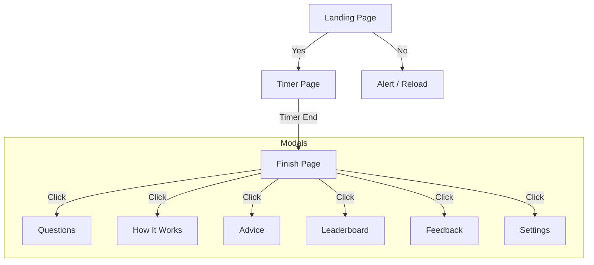

# Better Life - Application Blueprint

This document serves as a reference for the application's structure, defining pages, their elements, and the flow between them.

## Navigation Flow

## Page Definitions

### 1. Landing Page
**ID:** `#landing-page`
**Purpose:** Initial user engagement.
**Elements:**
*   `h1`: "Do you want to make your life better?"
*   `#btn-yes` (Button): Transitions to **Timer Page**.
*   `#btn-no` (Button): Triggers "Ok" alert and reloads.

### 2. Timer Page
**ID:** `#timer-page`
**Purpose:** The core focus session.
**Elements:**
*   `#timer-display` (Span): Shows MM:SS.
*   `#btn-start-timer` (Button): Toggles Start/Pause.
*   `#btn-help-icon` (Button): Toggles visibility of `#help-content`.
*   `#help-content` (Div): Contains advice text and `#btn-reveal-journal`.
*   `#journal-tab` (Div): Hidden by default. Contains `#journal-entry` textarea.
**Transitions:**
*   **Automatic**: When timer reaches 00:00 -> **Finish Page**.

### 3. Finish Page
**ID:** `#finish-page`
**Purpose:** Post-session summary and options.
**Elements:**
*   `h1`: "Good job, come back again tomorrow."
*   `.menu-buttons` (Div): Container for all menu options.
    *   `#btn-questions` -> Opens Questions Modal.
    *   `#btn-how-it-works` -> Opens Info Modal.
    *   `#btn-advice` -> Opens Advice Modal.
    *   `#btn-leaderboard` -> Opens Leaderboard Modal (Mock).
    *   `#btn-feedback` -> Opens Feedback Modal.
    *   `#btn-settings` -> Opens Settings Modal.

## Shared/Global Elements
*   `#modal-overlay` (Div): The background for all modals.
*   `#modal-content` (Div): The container for modal content (dynamically injected).
*   `#close-modal` (Span): Closes the active modal.

## Data State (LocalStorage)
*   `bl_timerDuration`: Current timer length (seconds).
*   `bl_lastDate`: Date string of the last completed session.
*   `bl_history`: Array of saved question entries.
